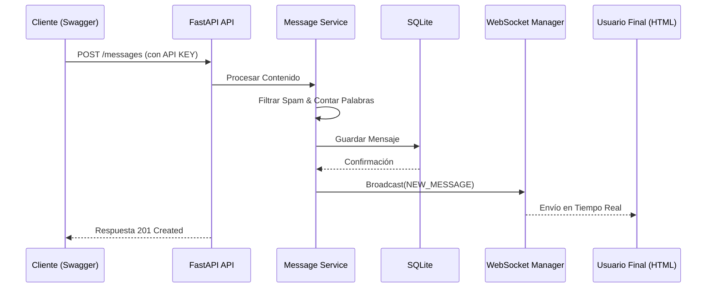

# Nequi Message Processor API

API creada para el procesamiento de mensajes, validación de datos y comunicación en tiempo real. Este proyecto implementa una arquitectura limpia separando capas de acceso a datos (Repositories), lógica de negocio (Services) y controladores (API).

## Características Principales
* **Tiempo Real:** Notificaciones instantáneas mediante WebSockets para actualizaciones de mensajes.
* **Procesamiento de Datos:** Cálculo automático de metadata (conteo de palabras y caracteres).
* **Seguridad:** Autenticación mediante `X-API-KEY` en endpoints críticos.
* **Persistencia:** Almacenamiento en SQLite gestionado con SQLAlchemy.
* **Calidad de Software:** Suite de pruebas automatizadas con Pytest que garantizan un 100% de cobertura en flujos principales.


## Tecnologías Utilizadas
* **FastAPI** (Framework principal)
* **Uvicorn[standard]** (Servidor ASGI con soporte WebSocket)
* **SQLAlchemy** (ORM para base de datos)
* **Pydantic** (Validación de esquemas)
* **Pytest** (Testing)

## Instalación y Configuración


1. **Clonar el repositorio:**
   ```bash
   git clone https://github.com/nash1914/API-RESTfull.git
   cd PruebaASD

2. **Configurar el entorno virtual:**

    python -m venv .venv


3. **Instalar dependencias:**

    pip install -r requirements.txt


4. **Ejecución:**

    python -m uvicorn app.main:app --reload


5. **Pruebas:**

    python -m pytest

## WebSockets

    ws://127.0.0.1:8000/api/ws

## Diagrama - Flujo de Arquitectura


