# **Pruebas unitarias**

Pruebas con palabras filtradas: 

Json Ejemplo: {

"message\_id": "msg-7",
"session\_id": "session-abcdef",
"content": "Hola, Prueba con palabritas **spam** u **ofensivo** para este contenido",
"timestamp": "2023-06-15T14:30:00Z",
"sender": "system"

}

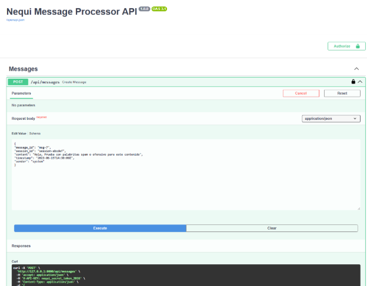

Respuesta: 

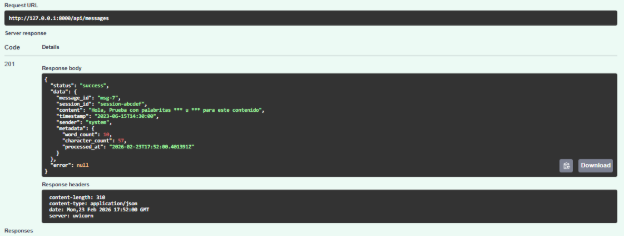

Se guarda en la base de datos: y realiza la “censura” de las palabras “prohibidas” y deja el registro de metadatos, en este caso conteo de palabras = 10.

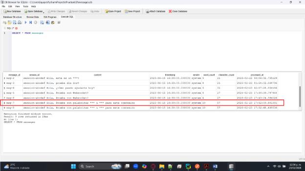

Se realiza, la validación en el swagger y se envían datos sin la KEY: 

Pruebas usando correctamente la KEY: 

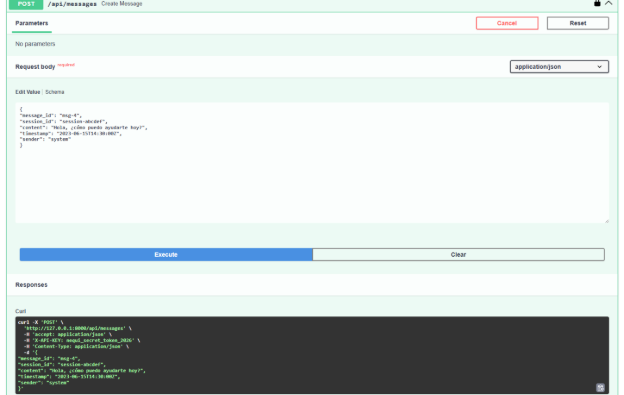

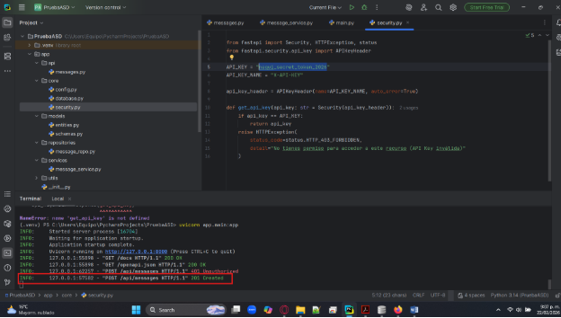

El mensaje se guarda correctamente en el archivo de persistencia .db el cual se abre en el gestor de bases de daatos SQLITE: 

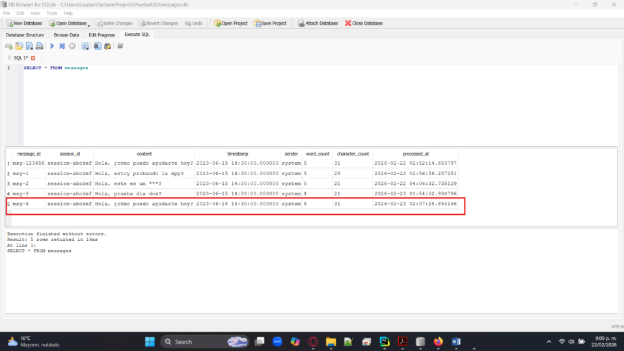

Pruebas con WebSocket + Swagger: 

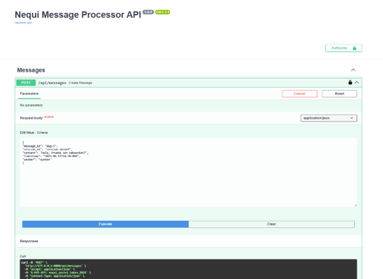

El postman se observa que llega el evento: 

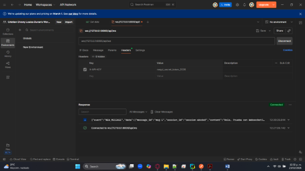

Se agrega un archivo HTML para ver el evento:

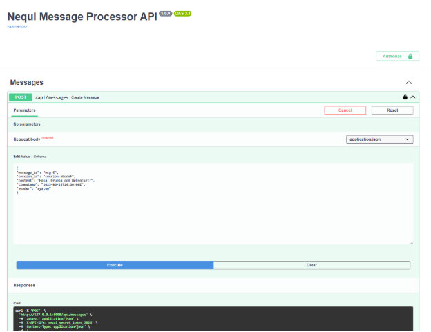

Llegando a postman: 

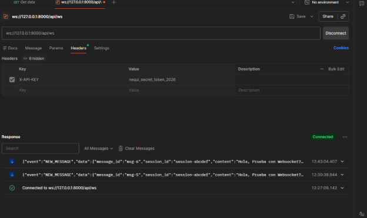

Monitor desde el navegador: 

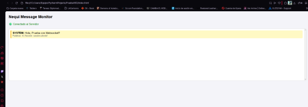

Pruebas Automatizadas Pytest: 

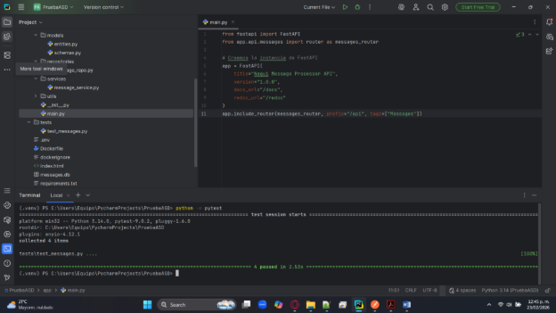

`		`Elaborado por Cristian Olvany Loaiza Durán
